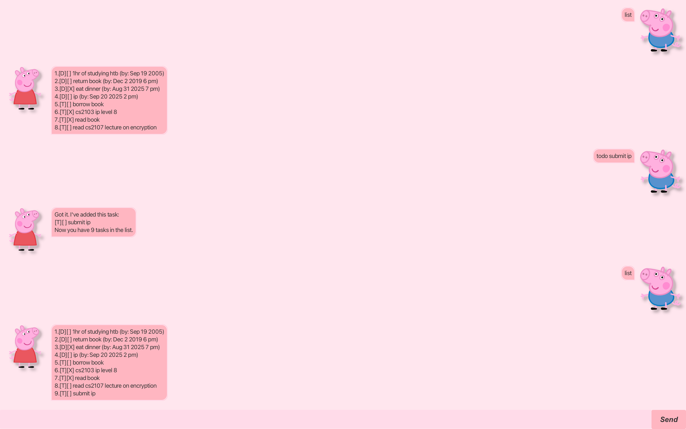

# Peppa Task Manager User Guide



Peppa Task Manager is a desktop application for managing your tasks through a Graphical User Interface (GUI). It supports three types of tasks: todos, deadlines, and events, with flexible date-time formatting and intelligent task sorting.

## Quick Start

1. Ensure you have Java 11 or above installed in your Computer.
2. Download the latest `peppa.jar` from [here](../../releases).
3. Copy the file to the folder you want to use as the home folder for your task manager.
4. Open a command terminal, `cd` into the folder you put the jar file in, and use the `java -jar peppa.jar` command to run the application.
5. Type your commands in the text box and press Enter to execute them.
6. Refer to the Features below for details of each command.

## Features

### Adding a Todo Task: `todo`

Adds a simple task without any date/time.

**Format:** `todo DESCRIPTION`

**Example:** `todo read book`

```
Got it. I've added this task:
[T][ ] read book
Now you have 1 tasks in the list.
```

### Adding a Deadline: `deadline`

Adds a task that needs to be done before a specific date/time.

**Format:** `deadline DESCRIPTION /by DATE_TIME`

**Supported Date-Time Formats:**
- With time: `d/M/yyyy HHmm`, `dd/MM/yyyy HH:mm`, `yyyy-MM-dd HH:mm`
- Date only: `d/M/yyyy`, `dd/MM/yyyy`, `yyyy-MM-dd`

When time is not specified, it defaults to 23:59 (end of day).

**Examples:** 
- `deadline return book /by 2/12/2019 1800`
- `deadline submit report /by 15/3/2024`
- `deadline project deadline /by 2024-03-15 18:00`

```
Got it. I've added this task:
[D][ ] return book (by: Dec 2 2019 6 PM)
Now you have 2 tasks in the list.
```

### Adding an Event: `event`

Adds a task that spans over a period of time.

**Format:** `event DESCRIPTION /from START_DATE_TIME /to END_DATE_TIME`

**Supported Date-Time Formats:** Same as deadlines

When time is not specified:
- Start time defaults to 00:00 (start of day)
- End time defaults to 23:59 (end of day)

**Examples:**
- `event project meeting /from 2/12/2019 1400 /to 2/12/2019 1600`
- `event conference /from 15/3/2024 /to 17/3/2024`
- `event workshop /from 2024-03-15 09:00 /to 2024-03-15 17:00`

```
Got it. I've added this task:
[E][ ] project meeting (from: Dec 2 2019 2 PM to: Dec 2 2019 4 PM)
Now you have 3 tasks in the list.
```

### Listing All Tasks: `list`

Shows all tasks in your task list, automatically sorted by priority.

**Format:** `list`

```
Here are the tasks in your list:
1.[D][ ] return book (by: Dec 2 2019 6 PM)
2.[E][ ] project meeting (from: Dec 2 2019 2 PM to: Dec 2 2019 4 PM)
3.[T][ ] read book
```

**Sorting Logic:**
1. Tasks with deadlines/times appear first, sorted by date/time (earliest first)
2. Tasks without deadlines/times (todos) appear last, sorted alphabetically

### Marking Tasks as Done: `mark`

Marks the specified task as completed.

**Format:** `mark INDEX`

**Example:** `mark 2`

```
Nice! I've marked this task as done:
[E][X] project meeting (from: Dec 2 2019 2 PM to: Dec 2 2019 4 PM)
```

### Marking Tasks as Not Done: `unmark`

Marks the specified task as not completed.

**Format:** `unmark INDEX`

**Example:** `unmark 2`

```
OK, I've marked this task as not done yet:
[E][ ] project meeting (from: Dec 2 2019 2 PM to: Dec 2 2019 4 PM)
```

### Deleting Tasks: `delete`

Removes the specified task from your task list.

**Format:** `delete INDEX`

**Example:** `delete 3`

```
Noted. I've removed this task:
[T][ ] read book
Now you have 2 in the list
```

### Finding Tasks: `find`

Finds tasks whose descriptions contain the given keyword.

**Format:** `find KEYWORD`

**Example:** `find book`

```
Here are the matching tasks in your list:
0.[D][ ] return book (by: Dec 2 2019 6 PM)
```

### Exiting the Program: `bye`

Exits the application.

**Format:** `bye`

```
Bye. Hope to see you again soon!
```

## Task Status Icons

- `[ ]` - Task not completed
- `[X]` - Task completed

## Task Type Prefixes

- `[T]` - Todo task
- `[D]` - Deadline task  
- `[E]` - Event task

## Data Storage

Peppa automatically saves your tasks to `./data/Peppa.txt` after each command. The data is loaded automatically when you start the application.

## Error Handling

- Invalid date formats will show an error message
- Invalid task indices will show appropriate error messages
- Corrupted data files will be handled gracefully

## Command Summary

| Action | Format | Example |
|--------|--------|---------|
| Add Todo | `todo DESCRIPTION` | `todo read book` |
| Add Deadline | `deadline DESCRIPTION /by DATE_TIME` | `deadline return book /by 2/12/2019 1800` |
| Add Event | `event DESCRIPTION /from START /to END` | `event meeting /from 2/12/2019 1400 /to 2/12/2019 1600` |
| List Tasks | `list` | `list` |
| Mark Done | `mark INDEX` | `mark 1` |
| Mark Undone | `unmark INDEX` | `unmark 1` |
| Delete Task | `delete INDEX` | `delete 1` |
| Find Tasks | `find KEYWORD` | `find book` |
| Exit | `bye` | `bye` |